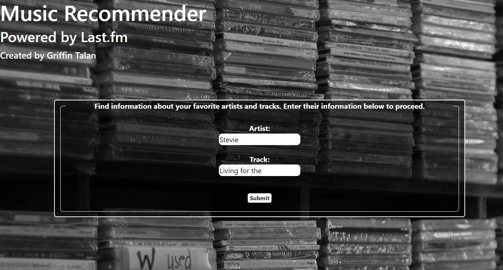
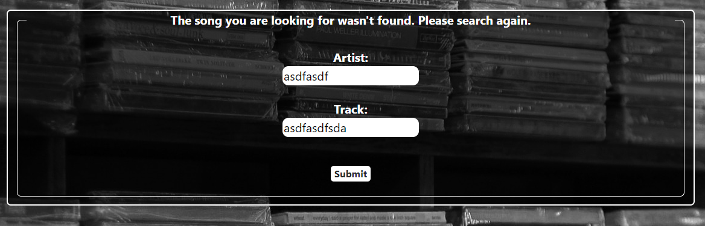
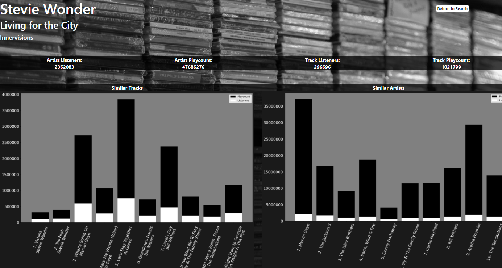
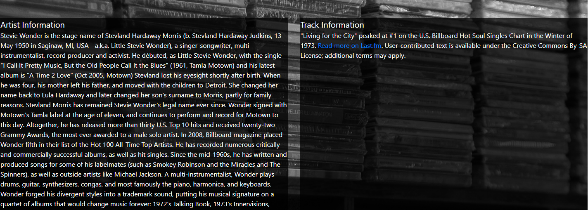

# Music Reccommender System using LastFM API

The purpose of this project was utilize LastFM's API to build a webapp that can produce artist and song data as well as visualize similar artists and tracks and their relative data visually. All HTML webpages use bootstrapping to ensure an organized layout across multiple window sized and devices.

The initial page that a user accesses allows them to search an artist and track without being overly accurate with what they type. This is achieved by executing separate artist and track searches and cross-referencing a list returned from both searches to find a match.

If no match is found, the user is redirected to a nearly identical page that asks them to search again.

If a successful match is found, the user is directed to a page that displays Artist, Track, Album, and numeric data associated with these fields. The cross-referenced result is subsequently fed into similar track and artist API's and visualized using Matplotlib images.

To make this system more robust, I would build a page that presents multiple artist/track matches to the user if they exist. This would allow the user to choose exactly what they had in mind after hitting the search button. 